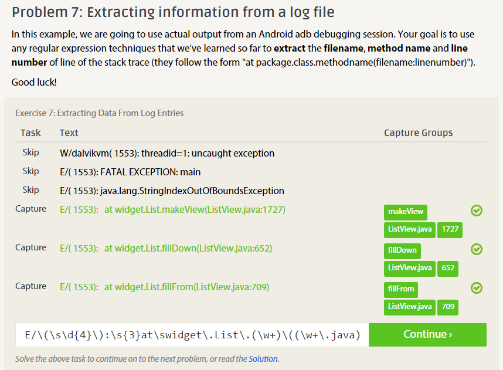
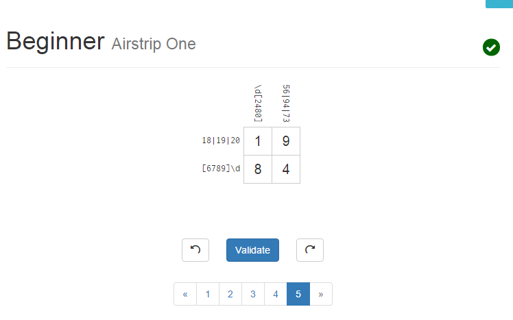
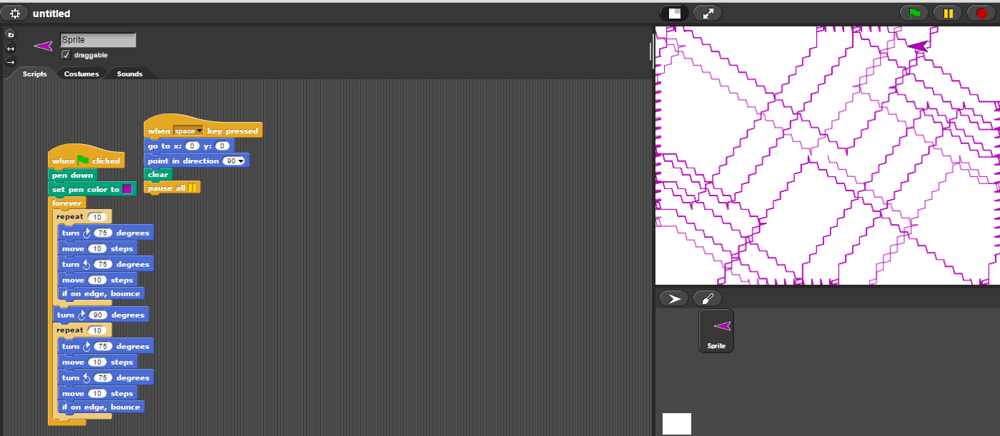

##Reading Assignment

Reading over the actual definition of open source, I understand it a little more than I had before. Initially, I thought it was just another term for freeware, not realizing there was a difference at all (mostly because this was before I understood most programming concepts, and so I didn't have a single clue what source code was). With the various terms of something being truly open source in mind, I'm certain that actually making something open source is trickier than just saying the source is open, and I'll have to be careful to make sure I do not mess up and claim something is open source when it turns out I accidentally didn't allow it to be used on all systems.

As for ways to answer a question helpfully, from my experience I've always found it best to assume first off that if the person hasn't listed things that they have tried to solve the problem, assume they haven't tried it and explain even the simple solutions without being rude about it. Some people will have tried it, but others might not have, so never assume that they have tried the "obvious solution." If they have said that they tried it already when they originall posted the question, well, don't say "try it" when they already did. Secondly, though this is an obvious one, even if you feel like they missed something that's obvious to you, don't say that it was the "obvious solution". Give them a break, they're trying their best.

##Linux

I was unable to get a boot disk for Linux from the class, though I made my own. I have not gotten the time to explore Linux or install tree, though I can do that quickly after class (I would now but Linux getting boot off of a USB takes so long I just don't have the time).

##regex

1.  Regexone

  1. -?\d+[e,.]?\d+[e,.]?\d+$)
  2. 1?\s?\(?(\d{3})\)?-?\s?\d{3}-?\s?\d{4}
  3. ([\w\.]+)
  4. <(a|div) (This is a solution specifically for this problem, but more general solutions exist.)
  5. (\w+)\.(jpg|png|gif)$
  6. \s*(.+)$
  7. E/\(\s\d{4}\):\s{3}at\swidget\.List\.(\w+)\((\w+\.java):(\d+)\)

2.  RegexCrossword

  1. HELP
  2. BOBE
  3. OOOO
  4. [Did not solve]
  5. 1984

##Snap/CSDT/Blockly

##Reflection

In terms of projects I would want to do, I'm not overly certain on any single one. The biggest idea I've had was to develop a small pseudo-roguelike, much like Nethack or ADOM, but with a little of a normal RPG twist, having randomly generated dungeons but rather than one person wandering into monsters that roam the field, all monsters would be done in random encounters, and handled like a turn-based RPG. I'm not quite sure how I would do this, as I've never really programmed something like that without the usage of a pre-existing engine, but I have some knowledge of game design, so perhaps if I were to team up with people, I could focus on the game design aspects (though of course I would try to program it myself as much as I could).