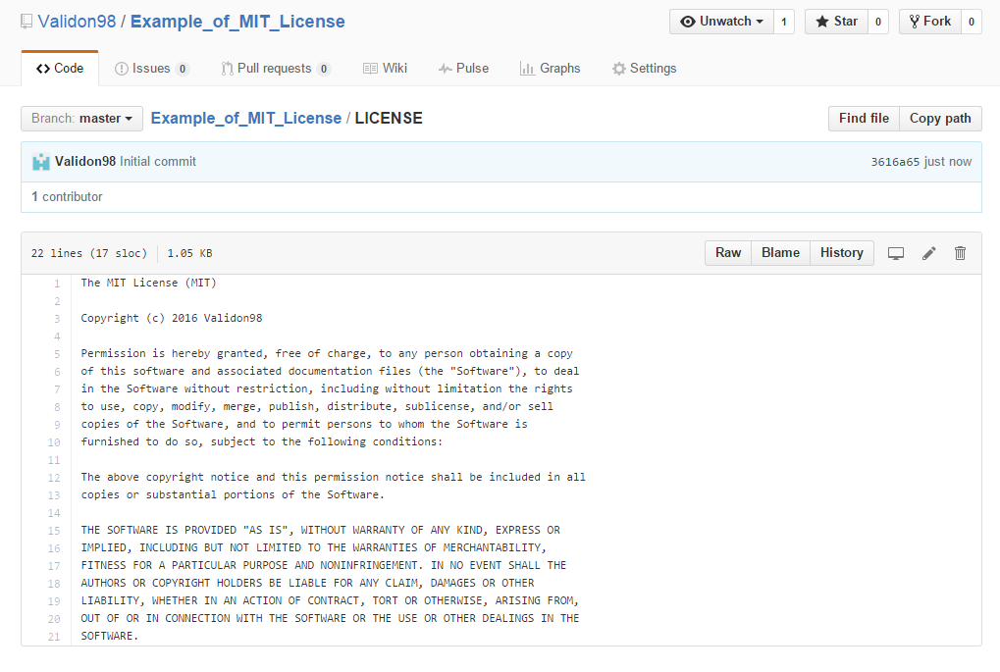

#Lab 2

####Why is it important to choose a license?

Software licenses are essentially the overall terms as to how the software can be used. Whenever any sort of software is distributed, there needs to be a license in order to describe what can be done with the program. Choosing a license as a result defines whether the software is meant to be open source, free software, or non-free software, as well as the terms for how the software developer wants his or her work to be used by consumers.

####Why shouldn't a project be used without a license?

Licenses are used to define the terms of how software can be used by others, so when a project lacks a license, users of the software have no idea what the terms are. At worst, this could mean that the project is considered to be under "all rights reserved", which means it is completely up to the developer to define what the rules are, and if they say nothing, there is no warning as to whether or not editing, redistributing, or even just looking at the source code is going to be against the developers' wishes. Projects without licenses therefore must be perused with caution, because you never know what is allowed and what isn't.

####Why the Web beat Gopher

The failure to follow the open source model perhaps might be the best explanation for why Gopher failed, but for certain it was a contribution. I personally feel like it's possible to develop something in a centralized manner and have it be successful, but the scope of the project Gopher was demanded it have some sense of openness to it, not only for developers but also for users. The licensing issue that came up due to .com domains requiring paying license fees while .edu domains did not is also a fairly major concern, due to discrimination between groups that would want to peruse the project, and when groups feel like there is discrimination going on, those same groups will most likely not support the project. Due to gaffes like that, Gopher would have lost a lot of support from companies as well as from pioneers of open source software, and that would have crippled them in the long run compared to the Web.

####Justification for License Use

Linux is an open source operating system kernel that, to this day, has a huge variety of branches and forks, most likely because the Linux kernel is under the GPL license. This license was chosen most likely to promote the development of operating systems that make use of the Linux kernel and to make it free and open while also preventing it from being given another identity, since under GPL you must include the original copyright (in other words, mention the OS was made with the Linux kernel) and show where to obtain and install the original software.

####License for Example Project

If I were to make a roguelike, similar to Angband (and its many variants, like Zangband and Hengband) or Hack (and its variants Nethack and Slash'em), I would most likely release it under GPL v3, since the GPL license is perfect for creating branches of the project that can improve upon the original, and it also allows those derivations to be improved upon by others.

####Which license is better for which?

In the case of a developer wanting to make use of a license, the ones they would most likely use in order to share their code would be LGPL or GPL, however in this case I believe LGPL would be of more use for developers. Libraries are the building blocks of a lot of software, and LGPL allows these building blocks to have the same level of license protection as larger projects such as the Linux operating system kernel. GPL itself would probably be moreso for the common good, since this license can apply to so many different types of projects, from operating systems to open source games and open source software tools like Open Office. Apache, meanwhile, is a license that requires and protects patents on ideas. This makes it the perfect license for companies, particularly software-related companies, as it allows them to come up with software and still be credited for that software when it is distributed under the license, such as for apps made for Android devices.

####Repository with a License (See picture)

####Observatory Table

Website | License Present | License
---------|:----------|:-------
https://github.com/CloudBench-IDE/cloudbench | Yes | Apache 2.0
https://github.com/wtg/shuttle_tracking_2 | Yes | MIT License (Does not label it as such though)
https://github.com/jonwrona/Table-Tome | Yes | MIT License
https://github.com/Behemyth/LifeSim | Yes | MIT License
https://github.com/polaritech/slick | Yes | MIT License

####Project

While above I mentioned the idea for a roguelike style game, another idea I feel would make for a good project would be a toolbox for game masters for different tabletop roleplaying games. The idea would be a collection of tools and quick rulesets that would make it easier for game masters (GMs) to create scenarios, encounters, monsters, and maps for different games. This project would be targeted towards people interested in tabletop roleplaying games, of course, and would most likely be released under GPL, to allow others to make branches of it that are more specifically suited for certain games that I cannot work with easily.

 This work is licensed under a http://creativecommons.org/licenses/by/4.0/ Creative Commons Attribution 4.0 International License.