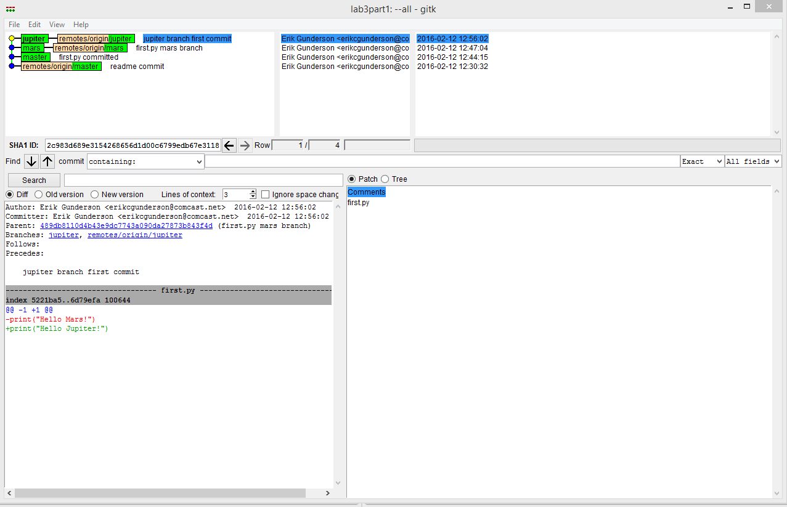
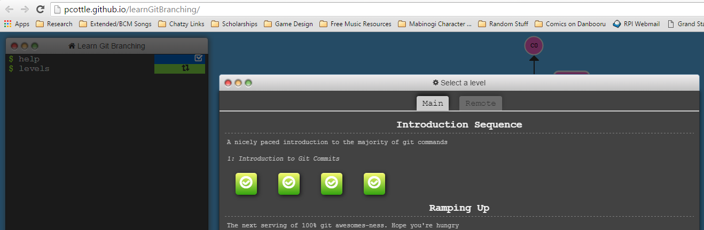

#Lab 3

####Part 1

gitk and git log are fairly similar, providing practically the same output. The only real difference is that gitk provides the git log via GUI, while the git log provides the log via bash.

https://github.com/Validon98/lab3part1

####Part 2

####Part 3

https://github.com/Validon98/courseproject

https://github.com/jonwrona/NewStory

 This work is licensed under a http://creativecommons.org/licenses/by/4.0/ Creative Commons Attribution 4.0 International License.