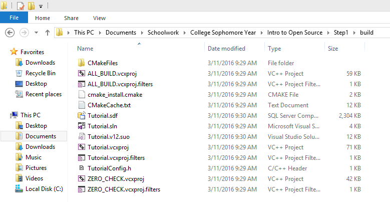
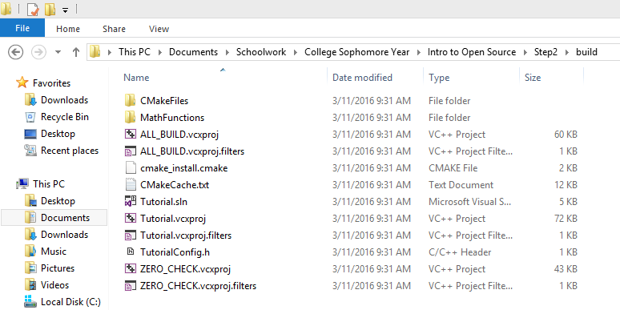
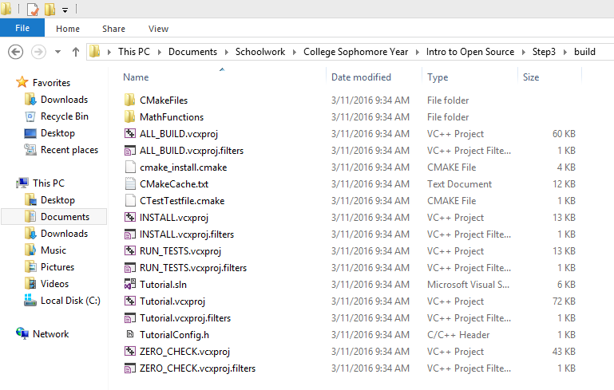
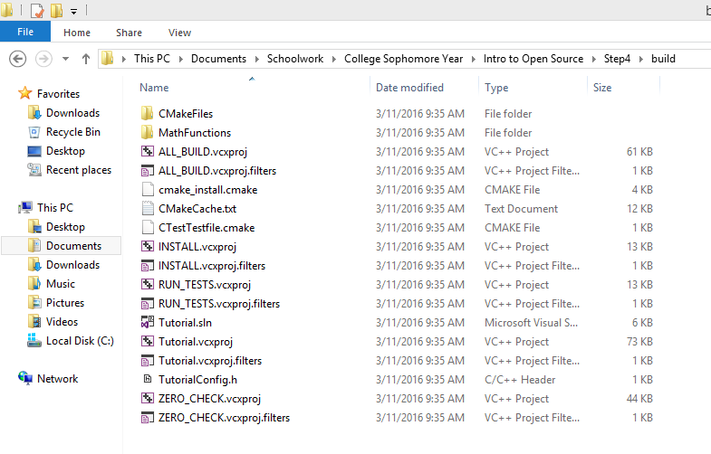

#Lab 5

The instructions for the lab were not extremely clear as to what I'm supposed to be posting up. If it's just the code, that's technically provided with the source code tree of CMake, so wouldn't everyone have the same easy-to-access copy anyhow? If it's to do with actually running CMake and making files, I was unable to produce MinGW makefiles, and could only produce Visual Studio 12 (2013) makefiles. I'll provide screenshots of the build folders for each step, since it does produce the build files properly, but I don't know what it means by pasting code here in the lab report, and I cannot run the build files myself due to my Visual Studio version being a trial.

####Step 1

####Step 2

####Step 3

####Step 4

####Step 5

