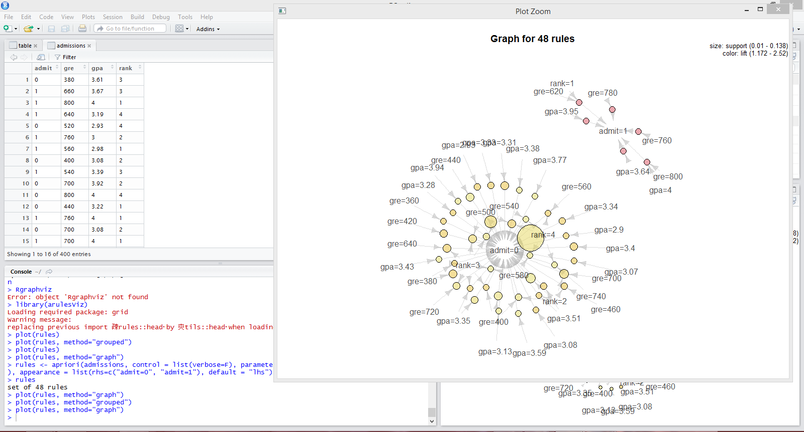

#Lab 8

The above is my plot along with the workspace I had for RStudio. I wasn't quite sure what values of confidence and support to use, due to the fact that if I kept it at default values, it would only give one rule, while lowering the values opened up so many rules that I feel are nonsensical. The main issue that I wasn't able to iron out was that it treated each value individually, instead of within some sort of range. I believe that for a data set like this, something that treats the values within a range would work better than looking at each individual value seperately.

###Project Progress

Not much has proceeded in the project, due to us having swapped over from our original idea to looking at a project known as Butter, which focuses more on movie streaming and viewing. I have received no details from our team's leader on what our objectives are in studying this program, so I cannot say much on what progress has been achieved. Until I find that out, I'm not sure what I will be able to accomplish, so hopefully we get together soon and figure this out.